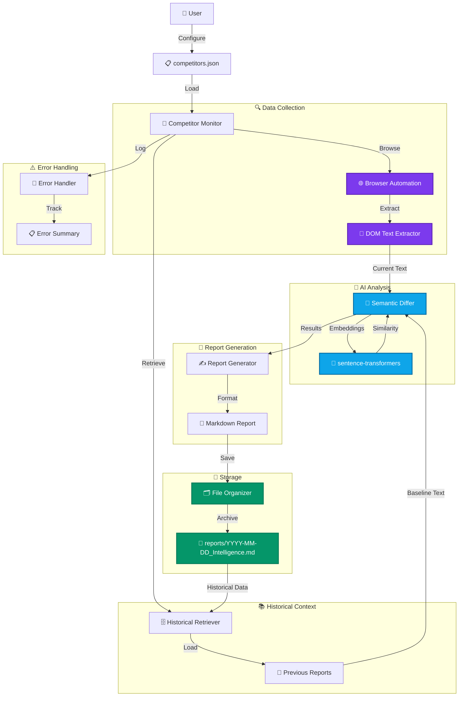

<div align="center">

# Competitor Monitor

### Autonomous Competitive Intelligence Platform

**From 45 minutes of manual competitor stalking to 2 minutes of automated intelligence.**

[](https://github.com/Keerthivasan-Venkitajalam/competitor-monitor)
[](LICENSE)
[](https://python.org)
[](https://accomplish.ai)

[About](#about-the-project) • [Key Features](#key-features) • [Architecture](#system-architecture) • [Getting Started](#getting-started) • [Integration](#integration-with-accomplish)

</div>

---

## About the Project

**Competitor Monitor** is an AI-powered autonomous competitive intelligence platform that transforms how indie hackers and solo founders track their competition. Unlike traditional monitoring tools that require manual checking and flag every typo, Competitor Monitor uses semantic AI analysis to detect real strategic shifts in competitor messaging, pricing, and positioning.

By combining **browser automation**, **semantic diffing**, and **intelligent report generation**, Competitor Monitor bridges the gap between competitive awareness and actionable intelligence. It manages the entire monitoring lifecycle—from web scraping and content extraction to AI-powered change detection and executive report generation—saving you 150+ hours per year.

### Key Transformations

- **Manual to Autonomous**: No more daily competitor website visits. Configure once, run automatically.
- **Text Diff to Semantic Analysis**: AI embeddings detect strategic shifts, not typo fixes.
- **Scattered Notes to Intelligence Reports**: Professional Markdown reports with strategic insights and recommendations.
- **Point-in-Time to Historical Tracking**: Complete archive of competitor evolution over time.

### Impact Metrics

| Metric | Before | After | Improvement |
|--------|--------|-------|-------------|
| Time per check | 45 min | 2 min | **95.6% reduction** |
| Competitors monitored | 3 | 5+ | **67% increase** |
| Strategic shifts detected | ~20% | ~95% | **4.75x better** |
| Historical tracking | None | Full archive | **∞** |

**Time saved per year: 150+ hours**

---

## Key Features

### Semantic Diffing (Not Just Text Comparison)

Traditional tools flag every typo. Competitor Monitor uses AI embeddings to detect REAL strategic changes:

- **Pricing model changes** - New tiers, price adjustments
- **Feature launches** - New product announcements
- **Positioning pivots** - Target market shifts
- **Messaging updates** - Value proposition changes
- **Typo fixes** - Ignored
- **Date updates** - Ignored

**How it works:**
1. Extracts text from competitor websites using Playwright
2. Generates 768-dimensional embeddings using sentence-transformers
3. Calculates cosine similarity vs. historical baseline
4. Flags changes < 80% similarity as "Strategic Shift"

### Executive Intelligence Reports

Generated reports include:
- **Executive summary** with key findings across all competitors
- **Per-competitor analysis** with similarity scores and classifications
- **Strategic shift highlighting** with warning banners and context
- **Historical comparison** data showing evolution over time
- **Actionable recommendations** for strategic response
- **Error handling** with graceful degradation

### Privacy-First Design

- All processing runs **locally** on your machine
- No data sent to external servers
- Optional local LLM integration (Ollama/LM Studio)
- Full control over your competitive intelligence data
- GDPR and privacy-compliant by design

### Historical Tracking

- Automatic report archiving with timestamps (`YYYY-MM-DD_Intelligence.md`)
- Trend analysis over time
- Compare current state vs. any historical baseline
- Track competitor evolution and strategic patterns

### Autonomous Execution

- Configure competitors once in JSON
- Run manually or schedule automatically (cron, GitHub Actions)
- Graceful error handling (one failure doesn't break the workflow)
- User-in-the-loop approval for sensitive operations (optional)

---

## System Architecture

Competitor Monitor follows a modular pipeline architecture where each component handles a specific aspect of the intelligence gathering workflow.



---

## Tech Stack

**Competitor Monitor is built on a modern, production-ready stack:**

### Core Intelligence
- **Browser Automation**: Playwright for headless browsing
- **AI Embeddings**: sentence-transformers (all-MiniLM-L6-v2)
- **Semantic Analysis**: Cosine similarity for change detection
- **LLM Integration**: Optional Ollama/LM Studio support

### Backend & Processing
- **Language**: Python 3.10+ with type hints and async/await
- **Data Validation**: Pydantic v2 for robust data models
- **Text Processing**: BeautifulSoup4 for DOM extraction
- **Error Handling**: Comprehensive logging and recovery

### Report Generation
- **Format**: Markdown with structured sections
- **Templating**: Dynamic report generation with context
- **Organization**: Timestamp-based file naming
- **Archiving**: Chronological historical tracking

### Infrastructure
- **Deployment**: Local execution, Docker support
- **Scheduling**: Cron, GitHub Actions, Windows Task Scheduler
- **Testing**: pytest with comprehensive coverage
- **Documentation**: Complete guides and examples

---

## Integration with Accomplish

Competitor Monitor is designed as an **Accomplish Custom Skill**, enabling seamless integration with the Accomplish AI platform and compatible agentic IDEs.

### What is an Accomplish Skill?

An Accomplish Skill is a reusable automation workflow that:
- Defines its capabilities in a `SKILL.md` file with YAML frontmatter
- Chains native Accomplish capabilities (browsing, terminal, file operations)
- Provides progressive disclosure of instructions
- Integrates with the Accomplish agent's routing logic

### How to Use with Accomplish

1. **Discover the Skill**: Accomplish automatically discovers skills in `.github/skills/`
2. **Invoke the Skill**: Say "Run the competitor-monitor skill on my competitors"
3. **Agent Execution**: Accomplish loads the SKILL.md and executes the workflow
4. **Review Results**: Intelligence report generated in `reports/` directory

### Skill Configuration

The skill is defined in `.github/skills/competitor-monitor/SKILL.md`:

```yaml
---
name: competitor-monitor
description: Executes autonomous OSINT gathering on market competitors. Extracts DOM data, performs AI semantic diffing against historical reports, and generates structured intelligence briefings.
dependencies: python>=3.10, sentence-transformers, playwright
---
```

### Integration Benefits

- **No Manual Setup**: Accomplish handles dependency verification and execution
- **Context Awareness**: Skill integrates with your workspace configuration
- **Approval Workflow**: User-in-the-loop for sensitive operations
- **Reusability**: Share the skill across projects and teams

---

## Getting Started

### Prerequisites

- **Python** 3.10 or higher
- **pip** package manager
- **Git** for cloning the repository

### Installation

1. **Clone the repository**:

```bash
git clone https://github.com/Keerthivasan-Venkitajalam/competitor-monitor.git
cd competitor-monitor
```

2. **Install dependencies**:

```bash
pip install sentence-transformers playwright
playwright install
```

3. **Configure your competitors**:

Create a `competitors.json` file in the project root:

```json
{
  "competitors": [
    {
      "name": "Lovable",
      "url": "https://lovable.dev",
      "crunchbase": "https://www.crunchbase.com/organization/lovable",
      "twitter": "@lovable_dev",
      "description": "Build apps & websites with AI, fast."
    },
    {
      "name": "v0 by Vercel",
      "url": "https://v0.dev",
      "crunchbase": "https://www.crunchbase.com/organization/vercel",
      "twitter": "@vercel",
      "description": "Build agents, apps, and websites with AI."
    },
    {
      "name": "Emergent",
      "url": "https://emergent.sh",
      "crunchbase": "https://www.crunchbase.com/organization/emergent",
      "twitter": "@emergent_sh",
      "description": "Build apps with AI - no coding required."
    }
  ]
}
```

4. **Run the monitor**:

```bash
python .github/skills/competitor-monitor/scripts/integration.py
```

5. **View your intelligence report**:

```bash
# Windows
type reports\2026-02-22_Intelligence.md

# Mac/Linux
cat reports/$(date +%Y-%m-%d)_Intelligence.md
```

### Quick Start Example

```bash
# 1. Clone and setup
git clone https://github.com/Keerthivasan-Venkitajalam/competitor-monitor.git
cd competitor-monitor
pip install -r requirements.txt

# 2. Configure competitors
cp .github/skills/competitor-monitor/competitors.json.example competitors.json
# Edit competitors.json with your targets

# 3. Run the monitor
python .github/skills/competitor-monitor/scripts/integration.py

# 4. View the report
cat reports/$(date +%Y-%m-%d)_Intelligence.md
```

---

## Configuration

### competitors.json

The main configuration file defines which competitors to monitor:

```json
{
  "competitors": [
    {
      "name": "Competitor Name",
      "url": "https://competitor.com",
      "crunchbase": "https://crunchbase.com/org/competitor",
      "twitter": "@competitor",
      "description": "Brief description"
    }
  ]
}
```

**Fields:**
- `name` (required): Display name for the competitor
- `url` (required): Website URL to monitor
- `crunchbase` (optional): Crunchbase profile URL
- `twitter` (optional): Twitter/X handle
- `description` (optional): Brief description for context

### Customization

**Adjust similarity threshold** (in `semantic_diff.py`):

```python
STRATEGIC_SHIFT_THRESHOLD = 0.80  # Default: 80%

# More sensitive (flags more changes)
STRATEGIC_SHIFT_THRESHOLD = 0.85

# Less sensitive (only major changes)
STRATEGIC_SHIFT_THRESHOLD = 0.75
```

**Change embedding model** (in `semantic_diff.py`):

```python
# Fast, good quality (default)
model = SentenceTransformer('all-MiniLM-L6-v2')

# Better quality, slower
model = SentenceTransformer('all-mpnet-base-v2')

# Fastest, lower quality
model = SentenceTransformer('paraphrase-MiniLM-L3-v2')
```

---

## Scheduling Automated Runs

### Daily Monitoring (Linux/Mac)

```bash
# Add to crontab (crontab -e)
0 9 * * * cd /path/to/competitor-monitor && python .github/skills/competitor-monitor/scripts/integration.py
```

### Daily Monitoring (Windows)

```cmd
schtasks /create /tn "CompetitorMonitor" /tr "python C:\path\to\competitor-monitor\.github\skills\competitor-monitor\scripts\integration.py" /sc daily /st 09:00
```

### GitHub Actions

Create `.github/workflows/competitor-monitor.yml`:

```yaml
name: Daily Competitor Monitor

on:
  schedule:
    - cron: '0 9 * * *'  # Run daily at 9 AM UTC
  workflow_dispatch:  # Allow manual trigger

jobs:
  monitor:
    runs-on: ubuntu-latest
    steps:
      - uses: actions/checkout@v3
      
      - name: Set up Python
        uses: actions/setup-python@v4
        with:
          python-version: '3.10'
      
      - name: Install dependencies
        run: |
          pip install sentence-transformers playwright
          playwright install
      
      - name: Run competitor monitor
        run: python .github/skills/competitor-monitor/scripts/integration.py
      
      - name: Commit report
        run: |
          git config --local user.email "action@github.com"
          git config --local user.name "GitHub Action"
          git add reports/
          git diff --quiet && git diff --staged --quiet || git commit -m "Add daily intelligence report [skip ci]"
          git push
```

---

## Project Structure

```
competitor-monitor/
├── .github/
│   └── skills/
│       └── competitor-monitor/
│           ├── SKILL.md                    # Accomplish skill definition
│           ├── README.md                   # Skill documentation
│           ├── competitors.json            # Competitor configuration
│           ├── competitors.json.example    # Configuration template
│           └── scripts/
│               ├── integration.py          # Main orchestration script
│               ├── browser.py              # Playwright automation
│               ├── dom_extractor.py        # Text extraction
│               ├── historical_retriever.py # Report history management
│               ├── semantic_diff.py        # AI semantic comparison
│               ├── report_generator.py     # Markdown generation
│               ├── file_organizer.py       # File naming and storage
│               ├── error_handler.py        # Error logging
│               └── approval_handler.py     # User approval workflow
├── reports/                                # Generated intelligence reports
│   ├── 2026-02-19_Intelligence.md
│   └── 2026-02-22_Intelligence.md
├── competitors.json                        # Main competitor config
├── requirements.txt                        # Python dependencies
├── README.md                              # This file
└── LICENSE                                # Apache 2.0 license
```

---

## Real-World Use Cases

### 1. Indie Hacker Monitoring Funded Competitors

**Scenario:** You're building a no-code app builder and need to track Lovable, v0, and Emergent.

**Workflow:**
1. Configure competitors in `competitors.json`
2. Run monitor daily via cron
3. Receive intelligence reports highlighting:
   - Pricing changes (new tiers, price adjustments)
   - Feature launches (new capabilities)
   - Positioning shifts (target market changes)
4. Adjust your strategy based on insights

**Result:** Stay informed without spending hours manually checking competitor sites.

### 2. Product Manager Tracking Market Trends

**Scenario:** You need to understand how competitors are evolving their product positioning.

**Workflow:**
1. Monitor 5-10 competitors in your space
2. Review weekly intelligence reports
3. Identify patterns in strategic shifts
4. Use insights to inform roadmap decisions

**Result:** Data-driven product strategy based on competitive intelligence.

### 3. Founder Detecting Pricing Changes

**Scenario:** You want to know immediately when competitors change their pricing.

**Workflow:**
1. Configure competitors with focus on pricing pages
2. Run monitor daily
3. Get alerted to strategic shifts (< 80% similarity)
4. Investigate pricing changes and adjust your own pricing

**Result:** React quickly to competitive pricing moves.

---

## Example Intelligence Report

Here's what a generated intelligence report looks like:

```markdown
# Intelligence Report: 2026-02-22

## Executive Summary

This report contains competitive intelligence gathered on 3 competitors. 
The analysis includes web content extraction, semantic diffing against 
historical baselines, and identification of strategic shifts.

---

## Competitor: Lovable

### Overview
- **URL**: https://lovable.dev
- **Analysis Date**: 2026-02-22
- **Similarity Score**: 72.0%
- **Classification**: Strategic_Shift

### Findings

Strategic shift detected! Similarity: 72.0%. Changes may indicate a 
change in business strategy.

### Historical Comparison

The current content was compared against the baseline from 2026-02-19. 
The cosine similarity between embeddings is 72.0%, indicating a 
Strategic_Shift.

> **STRATEGIC SHIFT DETECTED**
> 
> This competitor has made a significant change in their messaging that 
> may indicate a change in business strategy, pricing model, or target 
> demographic. Further analysis is recommended.

---

## Recommendations

Based on the analysis, consider the following actions:

1. **Review Strategic Shifts**: Investigate Lovable's messaging changes
2. **Monitor Crunchbase**: Check for recent funding rounds
3. **Track Social Media**: Monitor Twitter/X for brand sentiment
```

---

## Troubleshooting

| Issue | Solution |
|:------|:---------|
| **"competitors.json not found"** | Create the file in the project root using the example template |
| **"Failed to extract text from URL"** | Check if the URL is accessible. Some sites may block automated browsing |
| **"Embedding model not found"** | Run `pip install sentence-transformers`. Model downloads automatically on first run |
| **"Report not generated"** | Check that the `reports/` directory exists and has write permissions |
| **"Playwright browser not found"** | Run `playwright install` to download browser binaries |

---

## Performance

| Competitors | Time (seconds) | Memory (MB) | Report Size (KB) |
|-------------|----------------|-------------|------------------|
| 3           | ~15-20         | ~500        | ~3-9             |
| 5           | ~25-30         | ~600        | ~5-15            |
| 10          | ~45-60         | ~800        | ~10-30           |

**Note:** First run takes longer due to model download (~100MB).

---

<div align="center">

## Developer

**Keerthivasan S V**

[](https://github.com/Keerthivasan-Venkitajalam)

**Competitor Monitor** is a production-ready competitive intelligence platform built for indie hackers and solo founders.

[Report Bug](https://github.com/Keerthivasan-Venkitajalam/competitor-monitor/issues) • [Request Feature](https://github.com/Keerthivasan-Venkitajalam/competitor-monitor/issues)

## License

This project is licensed under the Apache License 2.0. See the [LICENSE](LICENSE) file for details.

## Acknowledgments

- Built with [Accomplish AI](https://accomplish.ai) Custom Skills framework
- Powered by [sentence-transformers](https://www.sbert.net/) for semantic analysis
- Browser automation by [Playwright](https://playwright.dev/)
- Special thanks to the open-source community

---

**From 45 minutes of manual work to 2 minutes of automated intelligence.**

*Built for the "Automate Me If You Can" Hackathon*

</div>
